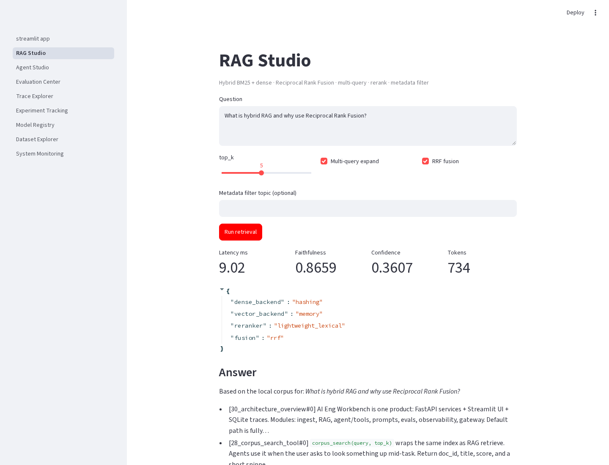
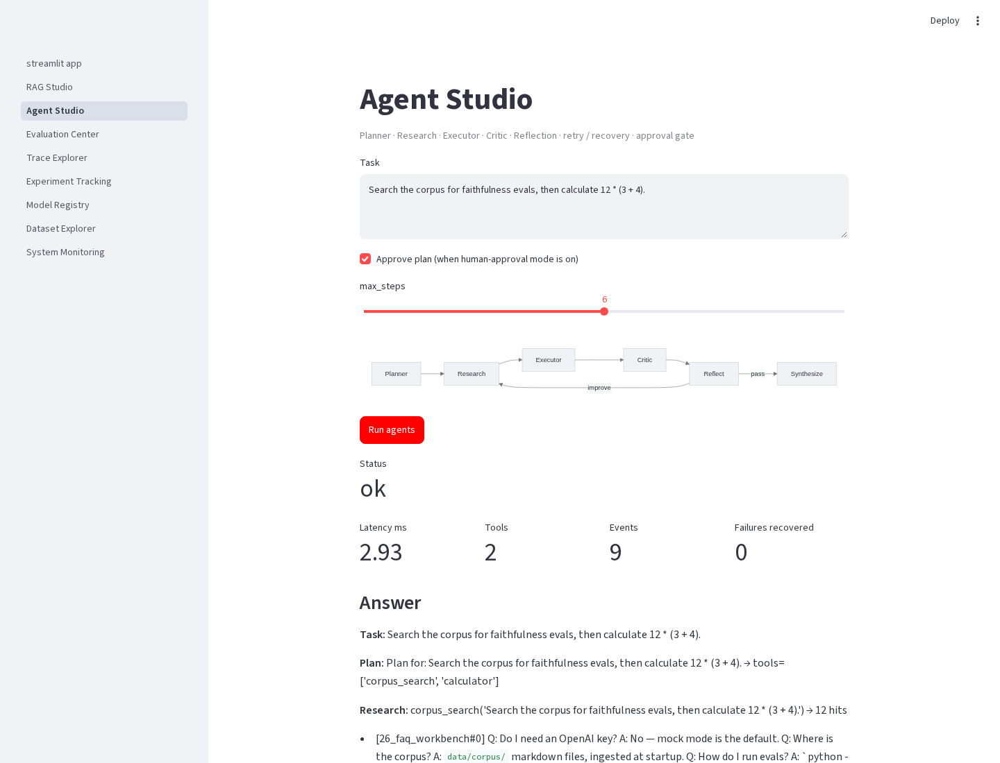
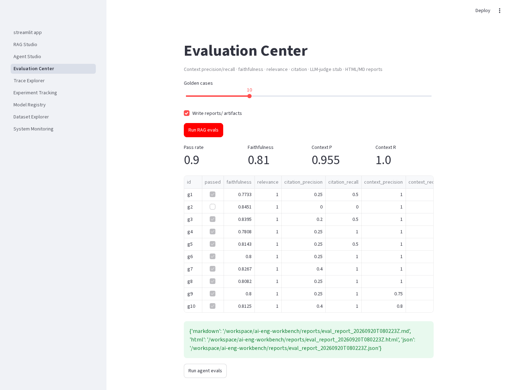
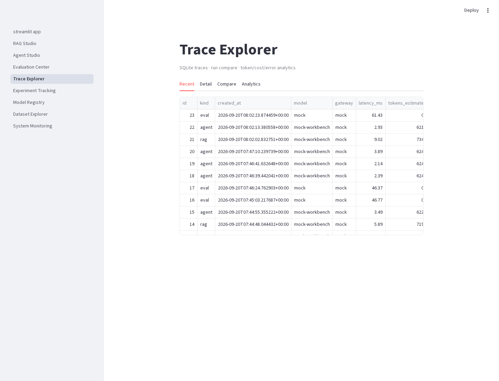
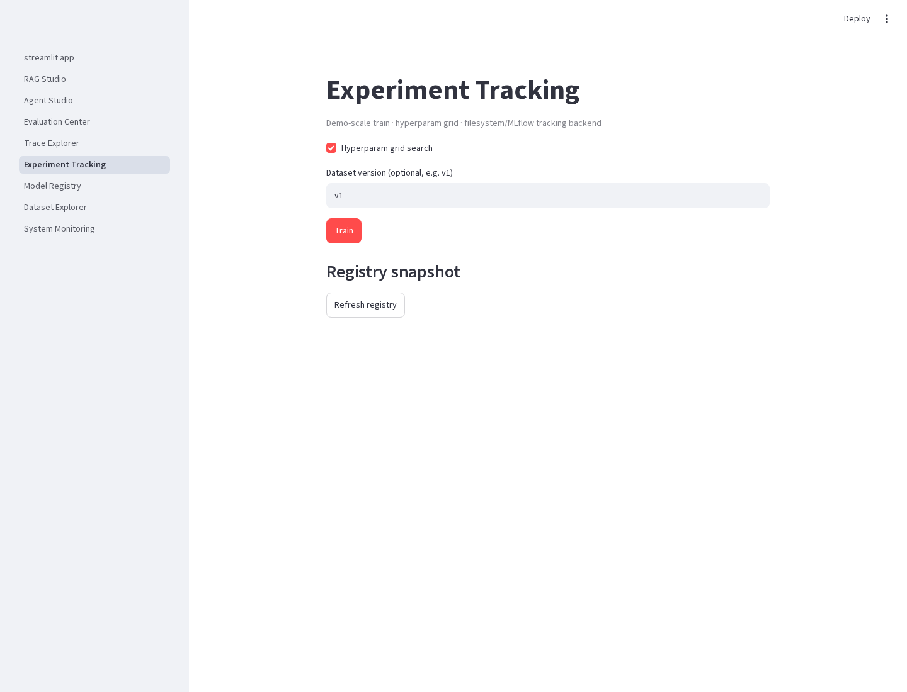
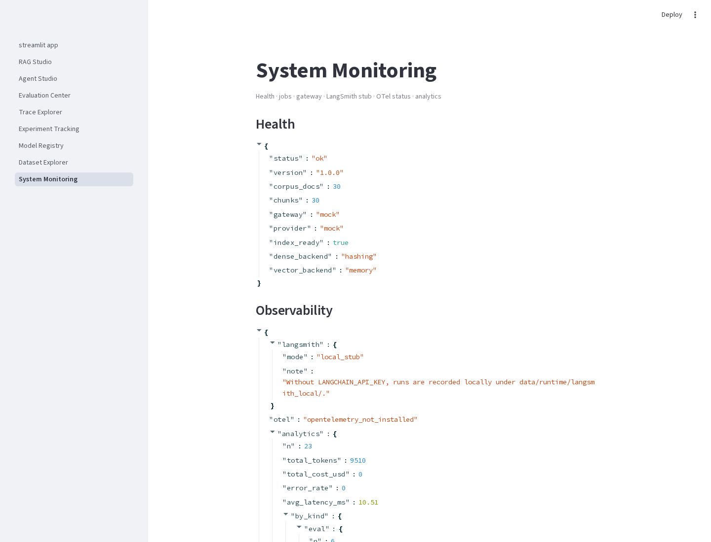

# AI Engineering Workbench

**Flagship local-first AI Engineering platform** — hybrid RAG, multi-agent workflows, evaluation, observability, ML eng, MLOps, and data eng — wired as one coherent system.

| | |
|---|---|
| **Stack** | FastAPI · Streamlit · SQLite · scikit-learn · Pydantic |
| **Default LLM** | Offline **mock** provider (no API key) |
| **Dense retrieval** | Hashing dense proxy by default; `sentence-transformers` optional |
| **Vectors** | In-memory · optional FAISS / Chroma · pgvector **interface stub** |
| **Status** | Portfolio / local-first — **not** a hosted SaaS |

[](https://github.com/tnishant082-dev/ai-eng-workbench/actions/workflows/ci.yml)


## Recruiter skill map

| Discipline | Where to look | What’s real locally |
|---|---|---|
| **Advanced RAG** | `app/rag/` | BM25 + dense, **RRF**, multi-query, expand, metadata filter, parent-child chunking, rerank (CE if installed else lexical), Recall@K / Precision@K / MRR / NDCG |
| **Vector stores** | `app/rag/stores/` | In-memory always; FAISS/Chroma via extras; **pgvector stub** |
| **Agents** | `app/agents/` | Planner → Research → Executor → Critic + reflection, memory, retry, recovery, tool validation, approval |
| **LLM Gateway** | `app/llm`, `app/gateway` | Provider protocol, mock + key-gated stubs |
| **Evals** | `app/evals`, `reports/` | Faithfulness, relevance, context P/R, citation P/R, judge stub, agent metrics, HTML/MD reports |
| **Observability** | `app/observability` | SQLite traces, compare, analytics, OTel no-op/console, LangSmith local stub |
| **ML Eng** | `app/ml`, `data/datasets/versions/` | Versioning convention, train, hyperparam grid, registry, batch/online predict, PSI drift, MLflow-or-filesystem tracking |
| **Data Eng** | `app/dataeng` | ETL, validation, quality, lineage, catalog, scheduler entrypoint |
| **Backend** | `app/api`, `app/core` | `/api/v1`, API-key **roles**, rate limit, cache, jobs, structured logs |
| **MLOps** | `.github/workflows`, Docker | CI lint+test+bandit, Compose healthchecks |
| **UI** | `ui/` | Premium multipage ops console (8 studios) |

## Demo

[Watch demo video](artifacts/ai-eng-workbench-demo.mp4)

| RAG Studio | Agent Studio |
|:---:|:---:|
|  |  |
| **Evaluation** | **Traces** |
|  |  |
| **Experiments** | **Monitoring** |
|  |  |

## Quick start (offline)

```bash
python -m venv .venv && source .venv/bin/activate
pip install -r requirements.txt
cp .env.example .env
uvicorn app.main:app --reload --port 8000
AIWB_API_KEY=dev-workbench-key API_URL=http://127.0.0.1:8000 streamlit run ui/streamlit_app.py
```

Optional: `pip install -e ".[dense,faiss,chroma,mlflow,otel,scheduler,dev]"`

### Sample curls

```bash
curl -s http://127.0.0.1:8000/health | jq
curl -s -X POST http://127.0.0.1:8000/api/v1/rag/query \
  -H 'Content-Type: application/json' -H 'X-API-Key: dev-workbench-key' \
  -d '{"question":"What is hybrid RAG and RRF?","top_k":5,"use_rrf":true}' | jq
curl -s -X POST http://127.0.0.1:8000/api/v1/agents/run \
  -H 'Content-Type: application/json' -H 'X-API-Key: dev-workbench-key' \
  -d '{"task":"Search the corpus for faithfulness evals, then calculate 12 * (3 + 4)."}' | jq
curl -s -X POST http://127.0.0.1:8000/api/v1/evals/run \
  -H 'Content-Type: application/json' -H 'X-API-Key: dev-workbench-key' \
  -d '{"limit":8,"write_report":true}' | jq .summary
```

## Fully local vs optional-cloud

| Capability | Default (local) | Optional |
|---|---|---|
| LLM | Mock templates | OpenAI / Groq / Ollama / Anthropic / Gemini with keys |
| Dense vectors | Hashing dense **proxy** (labeled) | `sentence-transformers` |
| Vector store | In-memory numpy | FAISS, Chroma |
| pgvector | Interface stub only | Real Postgres (not wired in demo) |
| Tracking | Filesystem store | MLflow if installed |
| OTel | No-op / console | Collector when SDK present |
| LangSmith | Local JSON recorder | Cloud when key + SDK |
| Scheduler | CLI `--once` + cron docs | APScheduler extra |

## Tests

```bash
AIWB_AUTH_DISABLED=1 pytest -q
```

## Honest limitations

- Corpus and churn dataset are **synthetic**.
- Default answers use a **mock** provider.
- Default dense encoder is a **hashing proxy** (unless extras installed).
- Evals are **heuristic** (+ judge stub).
- ML pipeline is **demo-scale** (200-row CSV).
- pgvector is an **interface stub**.
- No fake production uptime, MAU, or SLA.

See `docs/` for architecture, sequences, data flow, decisions, tradeoffs, security, scalability, deployment, and Mermaid diagrams.

## License

MIT © 2026 Nishant Tyagi \<tnishant838@gmail.com\>
