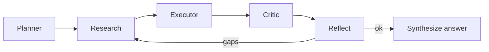

# Agent workflows

See also `docs/diagrams/agent_workflow.mmd`.

**Capabilities:** short-term memory, tool schema validation, retry on weak research, calculator recovery, human approval gate (`AIWB_REQUIRE_APPROVAL=1`).
