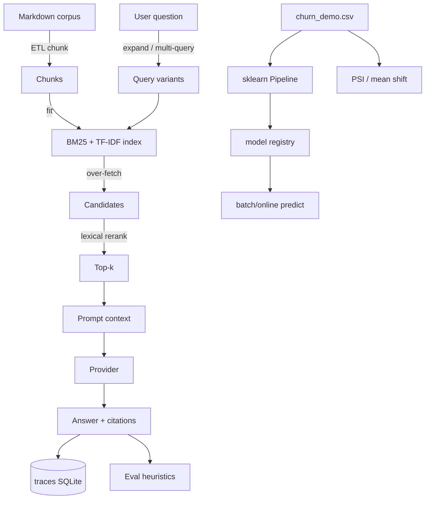

# Data Flow

```mermaid
flowchart TD
  MD[Markdown corpus] -->|ETL chunk| CH[Chunks]
  CH -->|fit| IDX[BM25 + TF-IDF index]
  Q[User question] -->|expand / multi-query| Q2[Query variants]
  Q2 --> IDX
  IDX -->|over-fetch| CAND[Candidates]
  CAND -->|lexical rerank| TOP[Top-k]
  TOP --> CTX[Prompt context]
  CTX --> LLM[Provider]
  LLM --> ANS[Answer + citations]
  ANS --> TR[(traces SQLite)]
  ANS --> EV[Eval heuristics]

  CSV[churn_demo.csv] --> TRAIN[sklearn Pipeline]
  TRAIN --> REG[model registry]
  REG --> PRED[batch/online predict]
  CSV --> DRIFT[PSI / mean shift]
```

## Lineage

See `data/lineage.json` after `POST /api/v1/dataeng/etl`. Edges capture corpus→chunks→RAG and CSV→model artifacts.
