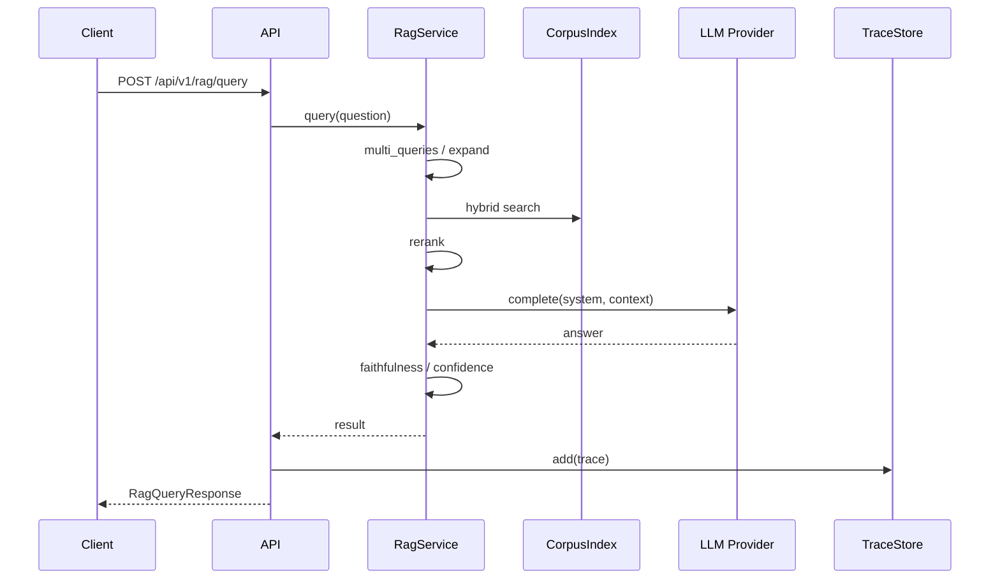
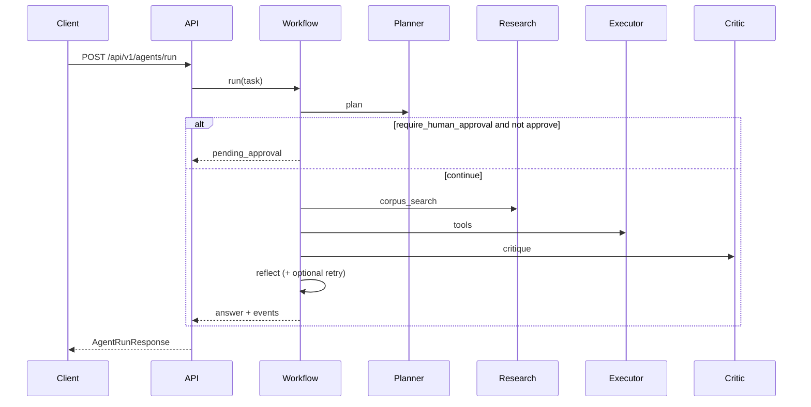

# Sequence diagrams

## RAG query

```mermaid
sequenceDiagram
  participant U as Client
  participant A as API
  participant R as RagService
  participant I as CorpusIndex
  participant L as LLM Provider
  participant T as TraceStore
  U->>A: POST /api/v1/rag/query
  A->>R: query(question)
  R->>R: multi_queries / expand
  R->>I: hybrid search
  R->>R: rerank
  R->>L: complete(system, context)
  L-->>R: answer
  R->>R: faithfulness / confidence
  R-->>A: result
  A->>T: add(trace)
  A-->>U: RagQueryResponse
```

## Multi-agent workflow

```mermaid
sequenceDiagram
  participant U as Client
  participant A as API
  participant W as Workflow
  participant P as Planner
  participant R as Research
  participant E as Executor
  participant C as Critic
  U->>A: POST /api/v1/agents/run
  A->>W: run(task)
  W->>P: plan
  alt require_human_approval and not approve
    W-->>A: pending_approval
  else continue
    W->>R: corpus_search
    W->>E: tools
    W->>C: critique
    W->>W: reflect (+ optional retry)
    W-->>A: answer + events
  end
  A-->>U: AgentRunResponse
```
